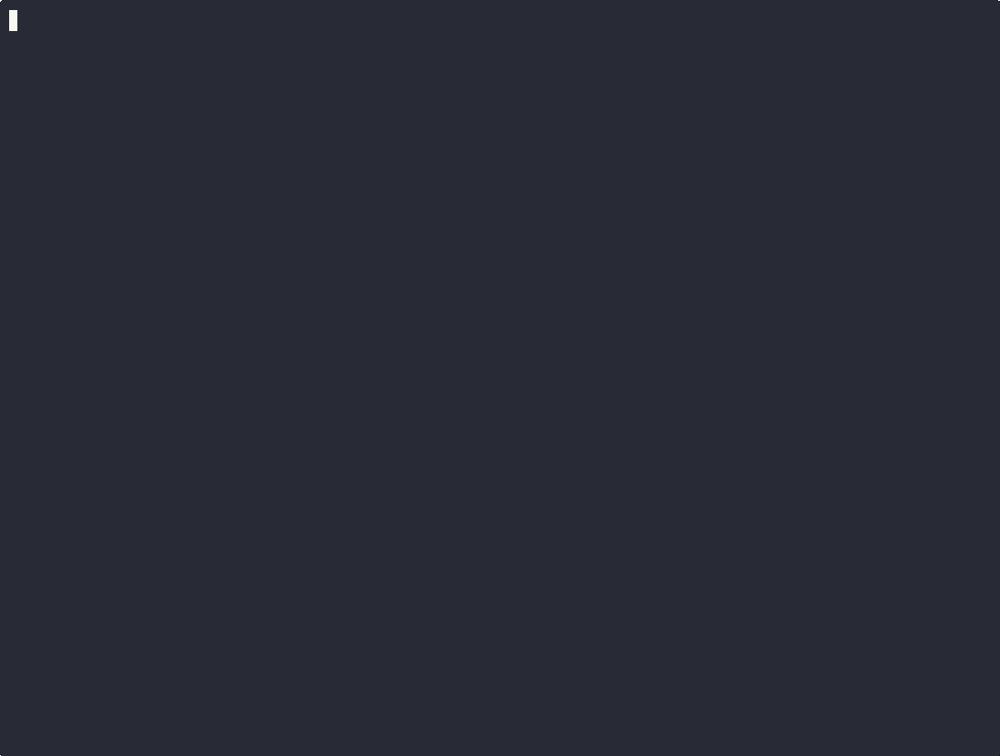

<div align="center">

# 🛡️ Auditor Core v2.2.1

## Deterministic Security Intelligence Layer

[](TERMS_OF_USE.md)
[](https://python.org)
[]()
[]()
[]()

*Engineering-grade signal. Not an alarm counter.*

**[🌐 Website](https://datawizual.github.io) · [📧 Get License](mailto:eldorzufarov66@gmail.com)**

---



</div>

---

## The Problem

Standard security tools such as Bandit, Semgrep, and Gitleaks generate large volumes of disconnected alerts.
Without context, these findings are difficult to prioritize and often lead to alert fatigue, wasted engineering time, and missed critical risks.

Isolated findings tell only part of the story. A hardcoded secret and a command injection vulnerability may each appear low or medium risk on their own — but together, they form a complete attack path to remote code execution. Without correlation, this chain goes undetected.

---

## The Solution

Auditor Core is a deterministic security auditing engine that transforms raw detection signals into a unified, context-aware security model.

It ingests findings from multiple detection engines and:

* Correlates and deduplicates overlapping results
* Detects multi-step attack chains across findings — not just individual vulnerabilities
* Adds architectural context to distinguish between core logic and infrastructure
* Applies weighted risk modeling using WSPM v2.2.1
* Maps every finding to SOC 2 Trust Services Criteria, CIS Controls v8, and ISO/IEC 27001:2022 Annex A
* Generates professional-grade PDF reports suitable for SOC 2 readiness engagements and cyber insurance underwriting

This results in a structured view of actual security risk — not isolated alerts.

---

## The Math Behind the Risk

Auditor Core computes a reproducible security posture score using the following model:

$$
SPI = 100 \cdot e^{-\frac{\sum \text{WeightedExposure}}{K}}
$$

The Security Posture Index (SPI) accounts for:

* Location of issues — production and infrastructure findings only (test files and docs excluded)
* Confidence across detection engines
* Exposure and reachability of findings
* Per-rule exposure cap to prevent score distortion from a single noisy detector
* Scaling factor (K) for consistency across project sizes

> **Gate Override (v2.2.1):** If CRITICAL findings exist in production code, the effective grade is capped at C — regardless of the mathematical SPI. This resolves the cognitive dissonance of a high SPI alongside a FAIL decision for CISO and underwriter audiences.

---

## Chain Analysis — Attack Path Detection

Auditor Core v2.2.1 introduces **Chain Analysis**: a deterministic engine that identifies multi-step attack paths by correlating findings that, in combination, create a materially higher risk than any single finding in isolation.

### How It Works

The Chain Analyzer runs after all detectors complete and before AI advisory. It evaluates findings against a configurable set of chaining rules, each defining a trigger condition and a consequence class. When a trigger finding and a consequence finding co-exist within the same codebase scope, a chain is formed.

Each chain:

* Receives a unique identifier (`CHAIN_XXXX`) visible across all report formats
* Is assigned a resulting risk level defined by the rule (typically `CRITICAL`)
* Escalates the severity of every finding in the chain to match the chain risk — a `LOW` severity secret that feeds a `CRITICAL` injection path is reported as `CRITICAL`
* Is passed to the AI advisor as an explicit chain context block, improving the accuracy of AI verdicts for chained findings

### Example

A hardcoded API key (initially `LOW`) and a `COMMAND_INJECTION` finding in the same module trigger the `secret_to_command_injection` rule. Both findings are escalated to `CRITICAL` and grouped under a shared chain ID. The AI advisor receives the chain context and evaluates the combined exploit path — not just the individual findings.

### What Gets Reported

All three output formats include chain information:

* **PDF** — a dedicated "Attack Path Analysis" section showing the full chain sequence with arrows between steps, chain ID, rule name, and risk level
* **HTML** — collapsible chain cards with step-by-step visualization and severity escalation indicators
* **JSON** — each finding includes a `chain` block with `chain_id`, `chain_risk`, `chain_rule`, and partner finding reference; the `framework_summary` block reflects escalated severities

### Configuration

Chain behavior is controlled via `audit-config.yml`:

```yaml
chaining:
  enabled: true
  max_chain_length: 5        # Maximum number of findings in a single chain
  max_line_distance: 100     # Maximum line distance between findings within the same file
  require_same_scope: true   # Restrict chaining to findings within the same directory scope
  max_scope_depth: 2         # Depth of shared parent directory for scope matching
  rules:
    - name: "secret_to_command_injection"
      triggers: ["SECRET_", "API_KEY", "TOKEN", "PASSWORD"]
      then: ["COMMAND_INJECTION", "SHELL_EXEC"]
      resulting_risk: "CRITICAL"
    - name: "weak_crypto_to_auth_bypass"
      triggers: ["WEAK_CRYPTO", "MD5", "SHA1"]
      then: ["AUTH_BYPASS", "PRIV_ESC"]
      resulting_risk: "HIGH"
```

Chains can be suppressed in `baseline.json` via `chain_suppressions`.
Suppression applies to the entire chain — individual findings within a chain cannot be suppressed independently.

---

## 🤖 AI Operation Modes — External and Fully Local

Auditor Core supports two AI operation modes:

* **External LLM mode** (default)
* **Local LLM mode** (fully offline)

This ensures flexibility for enterprise, regulated, or air-gapped environments.

### Design Principle

AI in Auditor Core is **advisory and validation-only**.
The deterministic scanning and Chain Analyzer always run first and produce a complete structural result independently of AI availability.

If AI is disabled or unavailable:

* All findings are still generated.
* Chain analysis still executes.
* SPI and Gate logic remain deterministic and reproducible.
* Reports are produced without AI commentary.

**AI enhances reasoning quality — it does not control enforcement.**

### Mode 1 — External LLM (Default)

External mode integrates with supported providers:

* Google Gemini (primary)
* Groq (automatic fallback)

Configuration example:

```yaml
ai:
  enabled: true
  mode: "external"
  external:
    provider: "google"
    model: "gemini-2.5-flash"
```

If Gemini quota is exceeded or unavailable, Auditor Core automatically switches to Groq without interrupting the scan.

External mode is suitable for:

* Standard enterprise environments
* Teams requiring large-context reasoning
* Organizations without air-gap restrictions

### Mode 2 — Local LLM (Fully Offline Operation)

Auditor Core can run entirely offline using a local model adapter.

```yaml
ai:
  enabled: true
  mode: "local"
  local:
    model_path: "/models/your-local-model.gguf"
    backend: "llama.cpp"
```

In local mode:

* No outbound network calls occur.
* No code or findings leave the machine.
* All AI validation runs inside the local environment.

This mode is designed for:

* Air-gapped deployments
* Government and defense environments
* High-sensitivity codebases
* Organizations with strict data residency policies

### Graceful Degradation

AI availability does not affect:

* Detection results
* Chain formation
* SPI calculation
* Gate override logic
* Compliance mapping

If AI fails, times out, or is disabled:

* Findings remain marked as UNVERIFIED
* Chain severity remains deterministic
* Reports include a note indicating AI advisory was skipped

**No scan is blocked due to AI failure.**

### Deterministic‑First Architecture Reminder

Auditor Core follows a strict execution order:

1. Deterministic detectors
2. Chain Analyzer
3. SPI computation
4. AI advisory layer (optional enrichment)

This guarantees:

* Reproducibility under audit scrutiny
* Stable results across runs
* No probabilistic finding generation
* Compliance-safe operation even without AI

### Security & Data Handling

Auditor Core does not transmit source code unless external AI mode is explicitly enabled.

* In local mode, all processing occurs on the host machine.
* AI receives structured finding context, not entire repositories.
* AI never generates new findings — it only validates existing deterministic results.
* This dual-mode architecture ensures that AI is a controlled reasoning amplifier — not a detection engine and not a runtime dependency.

---

## Output (ROI)

Auditor Core translates findings into actionable outputs:

| SPI    | Grade | Status            | Action                      |
| ------ | ----- | ----------------- | --------------------------- |
| 90–100 | A     | Resilient         | Audit-ready                 |
| 70–89  | B     | Guarded           | Monitor and schedule fixes  |
| 40–69  | C     | Elevated Risk     | Prioritize remediation      |
| 0–39   | D     | Critical Exposure | Immediate response required |

---

## Integration

Auditor Core outputs three report formats per scan:

* **PDF Executive Summary** — structured audit-ready document for SOC 2 readiness and cyber insurance underwriting (Marsh, Aon, At-Bay, Coalition). Includes attack path analysis, evidence appendix with source-level code context for every CRITICAL/HIGH finding, remediation roadmap, and attestation block with signature lines.
* **Interactive HTML Report** — Enterprise posture dashboard with SOC 2 / CIS / ISO 27001 control tags, AI analysis, chain visualization, and reachability breakdown. Suitable for engineering teams.
* **Machine-readable JSON** — CI/CD gating with `instance_count`, `instance_lines`, `compliance_mapping`, and `chain` block per finding; `framework_summary` block for direct SIEM integration.
* **AI-driven analysis** — Gemini 2.5 Flash with automatic Groq fallback (zero interruption on quota). AI verdicts are chain-aware: findings participating in a chain are evaluated in the context of the full attack path, not in isolation.

### Compliance Framework Coverage

Every finding is automatically mapped to:

| Framework | Standard |
|---|---|
| SOC 2 TSC | CC6.1, CC6.6, CC7.1, CC8.1 and more |
| CIS Controls v8 | CIS-16.1, CIS-16.12, CIS-3.11 and more |
| ISO/IEC 27001:2022 | A.8.28, A.8.26, A.5.17 and more |

Reports include a `framework_summary` block aggregating which controls are triggered across all findings — ready for direct submission to SOC 2 auditors or cyber insurance underwriters.

> This report does not constitute a formal SOC 2 audit opinion.
> For SOC 2 Type I/II certification, engage a licensed CPA firm.

---

## Installation

### Step 1 — Get Your License Key

Each installation is hardware-bound. Retrieve your Machine ID:

```bash
python3 -c "from auditor.security.guard import AuditorGuard; print(AuditorGuard().get_machine_id())"
```

Send the Machine ID to **eldorzufarov66@gmail.com** to receive your License Key.

> ⚠️ Each License Key is cryptographically bound to a specific machine.

### Step 2 — Extract and Install

You will receive a `.zip` archive. Extract it to any directory you prefer:

```bash
unzip auditor-core-<version>.zip
cd auditor-core
bash start.sh
```

`start.sh` will guide you through setup interactively:

1. **Accept Terms of Use** — type `YES` to proceed
2. **Enter your License Key** — provided after Step 1
3. **Set a database password** — choose any secure password
4. **Enter your Google Gemini API Key** — for AI-assisted analysis
5. **Enter your Groq API Key** — optional fallback AI (press Enter to skip)

After that, `start.sh` handles the rest automatically:
- Starts PostgreSQL via Docker Compose
- Creates Python virtual environment
- Installs all dependencies
- Makes `./audit` executable

### Step 3 — Run

```bash
./audit /path/to/your/project
```

Reports are saved to `reports/`:
```
reports/
├── report_<project>.pdf    ← Executive Summary (SOC 2 / cyber insurance ready)
├── report_<project>.html   ← Interactive Enterprise Posture Report
└── report_<project>.json   ← Machine-readable findings with compliance mapping
```

---

## Configuration

All scanning behavior is controlled via `audit-config.yml`:

```yaml
scanner:
  max_findings: 5000
  scan_tests: false
  exclude:
    - "**/venv/**"
    - "**/node_modules/**"

detectors:
  semgrep_detector: true       # 38 rules: Python/JS/TS/Go/Java
  bandit_detector: true        # Python AST security linter
  gitleaks_detector: true      # Entropy-based secret detection
  iac_scanner: true            # Terraform / Docker / Kubernetes
  dependency_scanner: true     # CVE matching with CVSS scoring
  cicd_analyzer: true          # GitHub Actions / GitLab / CircleCI / Azure DevOps / Bitbucket
  license_scanner: true        # SPDX / EUPL / CDDL / OSL / LGPL
  bridge_detector: true        # Web3 cross-chain bridge logic analysis
  slither_detector: true       # Solidity / Ethereum smart contract analysis

reporting:
  formats: ["html", "json", "pdf"]
  output_dir: "reports"

policy:
  fail_on_severity: "HIGH"
  min_severity: "LOW"

ai:
  enabled: true
  mode: "external"
  external:
    provider: "google"
    model: "gemini-2.5-flash"

chaining:
  enabled: true
  max_chain_length: 5
  max_line_distance: 100
  require_same_scope: true
  max_scope_depth: 2
```

---

## Requirements

| Component | Version |
|---|---|
| Python | 3.10+ |
| Docker | Required (PostgreSQL) |
| OS | Linux / macOS |
| reportlab | Required (PDF generation) |
| Gemini API | Optional (AI advisory) |
| Groq API | Optional (fallback) |
| Semgrep | Optional (SemgrepDetector + BridgeDetector) |
| Bandit | Optional (BanditDetector) |
| Gitleaks | Optional (GitleaksDetector) |
| Slither | Optional (SlitherDetector — Solidity projects) |
| solc | Optional (required by Slither) |

---

## What's New in v2.2.1

* **Chain Analysis** — deterministic detection of multi-step attack paths; findings participating in a chain are severity-escalated to reflect combined exploit risk; chains are visualized across all three report formats
* **Chain-aware AI advisory** — AI verdicts explicitly account for chain membership and combined exploit context, improving accuracy for correlated findings
* **PDF Evidence Appendix** — source-level code context for every CRITICAL/HIGH finding, audit-defensible out of the box
* **SOC 2 / CIS / ISO 27001 mapping** — every finding tagged to specific controls; `framework_summary` in JSON
* **Gate Override** — effective grade capped at C when CRITICAL findings exist in production, regardless of SPI
* **Context Intelligence** — `NON_RUNTIME` context (test/, docs/, examples/ prefixes) excluded from SPI by default; detector fixture files recognised as `SETUP`
* **Duplicate aggregation** — multiple findings in the same file shown as one block with line list in PDF
* **Unified assessment language** — consistent verdict labels across PDF and HTML formats
* **NUL-byte sanitization** — binary files no longer cause database errors
* **Delivery packaging** — Cython-compiled `.so` distribution for IP protection
* **Extended CI/CD coverage** — CI/CD Analyzer expanded to 20 dangerous execution contexts with native support for GitLab CI, CircleCI, Azure DevOps, and Bitbucket Pipelines in addition to GitHub Actions
* **Web3 security suite** — Bridge Detector and Slither Detector added for cross-chain bridge logic analysis and Ethereum smart contract static analysis
* **Semgrep ruleset expansion** — 38 custom rules across Python, JavaScript, TypeScript, Go, and Java covering ENV_INJECT, COMMAND_INJECTION, SQL_INJECTION, SECRET, XSS, SSRF, PATH_TRAVERSAL, WEAK_CRYPTO, INSECURE_DESERIALIZATION, AUTH_BYPASS, and OPEN_REDIRECT
* **AI hardening** — API key moved to secure request header (CWE-312 remediation); prompt injection protection via input sanitization (CWE-20); structured response parsing corrected for Gemini API
* **Taint Engine precision** — structural AST analysis replaces string-based source matching, eliminating alias bypass false negatives and reducing false positives on variable name collisions
* **Chain ENV_INJECT rules** — four new bridge_logic chain rules: env-var-injection-to-shell, env-var-injection-to-query, env-var-indirect-ref-config, request-param-to-shell
---

## FAQ

**Does Auditor Core send data anywhere?**
No. Fully offline operation. The only outbound connection is to the AI API if explicitly configured.

**What if Gemini API quota is exceeded?**
Auditor Core automatically switches to Groq (llama-3.3-70b-versatile) as fallback. Zero interruption.

**What is Chain Analysis and how does it affect severity?**
Chain Analysis detects combinations of findings that together form a complete attack path — for example, a hardcoded credential feeding a command injection. When a chain is detected, all participating findings are escalated to the chain's resulting risk level (typically CRITICAL), even if their individual severity was lower. This ensures that correlated risks are never underreported.

**Can the PDF report be used for SOC 2 readiness?**
Yes — as supporting evidence for pre-assessment and gap analysis. It does not constitute a formal audit opinion. For SOC 2 Type I/II certification, engage a licensed CPA firm.

**Can the PDF report be submitted to cyber insurance underwriters?**
Yes. The report format is designed to align with underwriting pre-assessment requirements from Marsh, Aon, At-Bay, and Coalition.

**How is Auditor Core different from Sentinel Core?**
Auditor Core v2.2.1 is a deep audit engine — run on demand for comprehensive posture reports. [Sentinel Core](https://datawizual.github.io) is a real-time enforcement gate that intercepts every commit. Sentinel uses Auditor Core internally as its scanning engine.

**Can I integrate JSON output into my SIEM?**
Yes. The JSON report is designed for downstream integration with SIEM platforms, dashboards, and CI/CD quality gates. Each finding includes a `chain` block where applicable, allowing SIEM rules to filter or escalate on chain risk independently.

**Does Auditor Core support non-Python codebases?**
Yes. SemgrepDetector covers Python, JavaScript, TypeScript, Go, and Java with 38 built-in rules. BanditDetector is Python-only. BridgeDetector and SlitherDetector target Solidity smart contracts.

**Does Auditor Core analyze CI/CD pipelines beyond GitHub Actions?**
Yes. The CI/CD Analyzer natively supports GitHub Actions, GitLab CI, CircleCI, Azure DevOps, and Bitbucket Pipelines — detecting injection vectors, unpinned actions, dangerous execution contexts, and secret exposure patterns across all five platforms.

---

## Support

📧 **eldorzufarov66@gmail.com**

Please include: Machine ID · OS version · Python version · `last_api_debug.txt` if applicable. 

---

<div align="center">

© 2026 DataWizual Security Labs. All rights reserved.

Use governed by [TERMS_OF_USE.md](TERMS_OF_USE.md)

</div>
